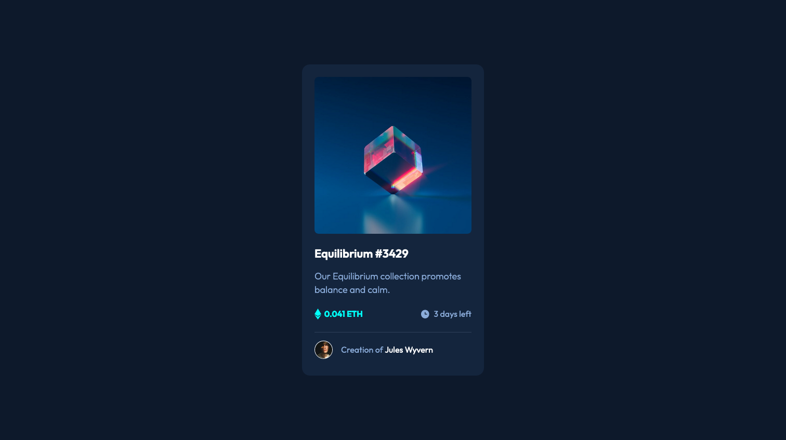

# Frontend Mentor - NFT preview card component solution

This is a solution to the [NFT preview card component challenge on Frontend Mentor](https://www.frontendmentor.io/challenges/nft-preview-card-component-SbdUL_w0U). Frontend Mentor challenges help you improve your coding skills by building realistic projects.

## Table of contents

- [Overview](#overview)
  - [The challenge](#the-challenge)
  - [Self-assigned challenges](#self-assigned-challenges)
  - [Screenshot](#screenshot)
  - [Links](#links)
- [My process](#my-process)
  - [Built with](#built-with)
  - [What I learned](#what-i-learned)
  - [Continued development](#continued-development)
  - [Useful resources](#useful-resources)
- [Author](#author)

## Overview

### The challenge

Users should be able to:

- View the optimal layout depending on their device's screen size
- See hover states for interactive elements

### Self-assigned challenges:

- Layout the card itself using Flexbox.
- Build as if it's a card in a grid: For me, this means working from an assumption that variables have already been created and use these. This means I'll have to create my own variables, should be interesting...
- Separate out my styles into different files (e.g. `global.css`, `variables.css` etc.)
- Try to avoid using too many long nest/parent css selectors and, where possible, build universal classes that could be used elsewhere in the wider site (e.g. rather than `.card p`, use `component-body`).
- Build a proper CSS doc with Table of Contents and Sections.

### Screenshot

### Links

- [Solution URL](https://www.frontendmentor.io/solutions/nft-card-challenge-h8UCt-xfyT)
- [Live Site URL](https://sh-nft-card.netlify.app/)

## My process

1. Built a library of custom CSS properties for every colour, font-size, font-weight, gutter spacing and corner radii that came up in the figma file.
2. Built my HTML with class names and wrappers for content.
3. Went back over the HTML to clean up any non-semantic class names I'd used as well as ensuring that I wasn't using divs when I could have been using something better (e.g. `section.card` rather than `div.card`).
4. Laid out my CSS table of contents to keep everything in order.
5. Got the card layout working, then moved onto colours and the other aesthetic stuff.
6. As needed, created utility classes rather than unique classes for functionality such as hover effects that could be re-used in other areas in the future.
7. Double-checked against Figma file to catch anything missing.
8. Checked browser support.
9. Commit!

### Built with

- Semantic HTML5 markup
- CSS custom properties
- Flexbox

### What I learned

- Creating names for variables is a lot tougher than you'd think. For example, I'd initially go with names like `--header-colour`, but I then realised in a bigger project that colour would most likely get used in other elements and as such that name wouldn't make sense. I spent a good amount of time researching best practices on this (see variables.css for more info).
- `::before` and `::after` pseudo-elements and how much they rock.
- That I can never type `pseudo` without typing out `speudo` first.
- That it's easy to style elements when doing so in a vacuum, but it's a whole other ballgame when you're trying to create utility classes that would work with other elements too.
- That the way that figma shows font-weights is slightly different from web-browsers, so don't sweat it.
- Not to be afraid to nest flexboxes.

### Continued development

- I feel like I'm starting to get to grips with Flexbox. I want to make sure that I'm using it in more complex scenarios in the future to further embed my learning.
- My next project actually won't be a frontend mentor challenge — instead, I'm gonna make my own skeleton folder as a starting point for future challenges that already has the stuff that I've built in this project (utilities, custom property names, table of contents etc) ready to go.
- I found myself resetting a few CSS properties in this project. In the future, it might be time to start incorporating a global reset from the beginning.

### Useful resources

- [How to name font size variables](https://css-tricks.com/the-dilemma-of-naming-font-size-variables/) Full of ideas, I ended up going with 100-900 scale for font sizes as this made sense to me given my brain already understands 100-900 scale for font-weight.
- [Why use @media instead of link:css?](https://stackoverflow.com/a/10037064) Helped me understand when it is appropriate to use @media to link a stylesheet and when to simply use another link:css in the html doc.
- [How to add watermark to image](https://stackoverflow.com/a/48365768) Used this to help me figure out how to add the overlay over the top of the image when hovered over.
- [::before and ::after pseudo-elements](https://css-tricks.com/almanac/selectors/a/after-and-before/) This is where the aha moment came for making the image overlay work.
- [Bootstrap source code](https://getbootstrap.com/docs/5.1/getting-started/download/) Very helpful to dive into when trying to make my utility classes work.

## Author

- Website - [Sam Hemingway](https://samhemingway.github.io/)
- Frontend Mentor - [@SamHemingway](https://www.frontendmentor.io/profile/SamHemingway)
